# Hospedar um site feito em React usando o Github

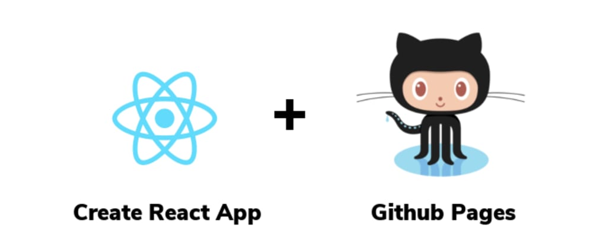

Passo a passo simples para disponibilizar seus sites estáticos React gratuitamente no Github.

Vejo o resultado final [Click-me](https://j0se-luiz.github.io/site-react-on-git/)
<br/><br/>

## Passo 1: Crie um repositório no github

Para iniciarmos, Crie um repositório no github. <br/>
Lembrando que o nome do seu site será o mesmo que você colocar no seu repositório. exemplo o meu é **site-react-on-git**

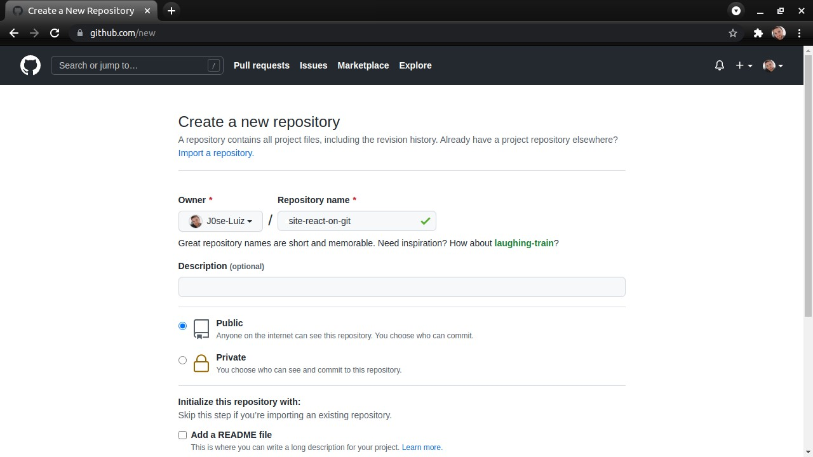
<br/><br/>

## Passo 2: Crie um projeto usando create-react-app:

use o comando: npx create-react-app **site-react-on-git**
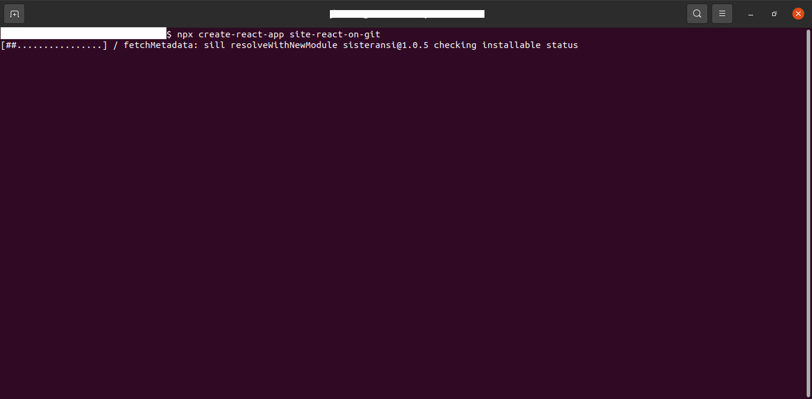
<br/><br/>

## Passo 3: Crie a pasta com os arquivos build compilados

Dentro da pasta criada execute o comando npm run build. Esse comando criará uma pasta na raiz chamada “build”, e lá você encontrará todos os arquivos compilados do seu projeto, que usaremos para nosso site funcionar.

```shell
cd site-react-on-git
npm run build
```

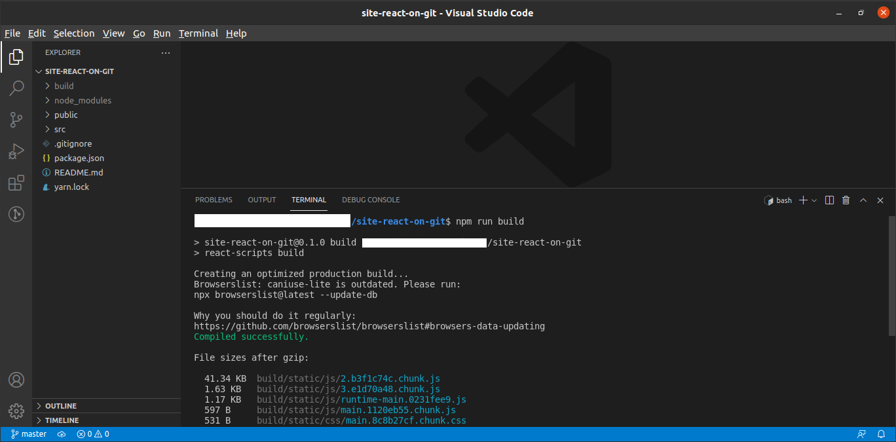
<br/><br/>

## Passo 4: Inicialize o git no projeto

Talvez o create-react-app tenha iniciado o git do projeto. Caso isso ocorra, **delete a pasta** do git e reinicie. obs..(a pasta do git fica oculta.)
dentro da pasta do repositorio ela vai ta como **.git**
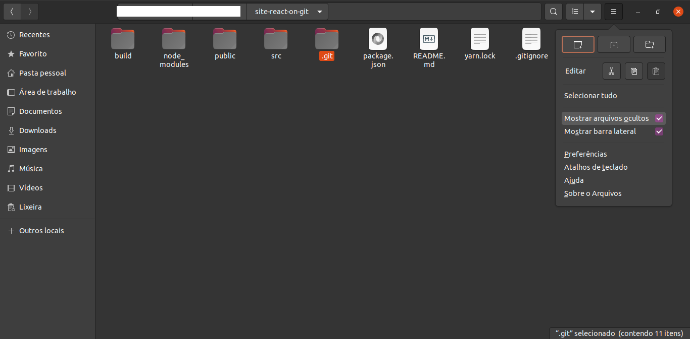

```shell
git init
git remote add origin [url do repositorio]
```

Apos inicializar faça um commit e um push para o repositório criado. com isso seu código fonte já estará disponível no seu repositório na branch master.

```shell
git add *
git commit -m "versao inicial"
git push
git push --set-upstream origin master
```

<br/><br/>

## Passo 5: Adicione o GH-pages ao projeto

é essa dependência que fará todo o trabalho para nós.

Ela cria uma nova **branch** no nosso repositório e sobe os arquivos compilados do projeto para o repositório. Os arquivos dessa branch serão usados para criar o nosso site no github. adicione gh-pages.

```shell
npm install -g gh-pages --save-dev
```

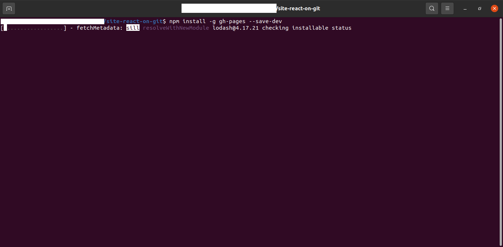
<br/><br/>

## Passo 6: Publicando o site react estático no github

Para publicar o site, devemos executar o comando que cria os arquivos compilados de nosso projeto. Comece executando o comando **npm run build**.

Em seguida, acesse a pasta .bin. Siga esse caminho: **./node_modules/.bin**.

Ao acessar a pasta, você executará o comando gh-pages -d ../../build. Ele entrará dentro da pasta de build e subir os arquivos compilados para **branch gh-pages no github.**

```shell
npm run build
cd node_modules
cd .bin
gh-pages -d ../../build
```

Ao final desse processo, aparecerá uma notificação informando a publicação dos arquivos.

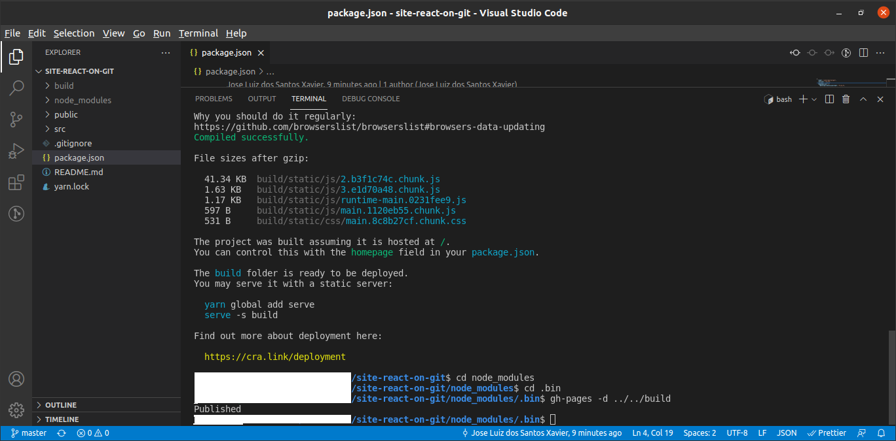

Agora quando você acessar o seu repositório, verá que existem **dois branches** (master e gh-pages). Onde você encontrará todos os arquivos compilados.

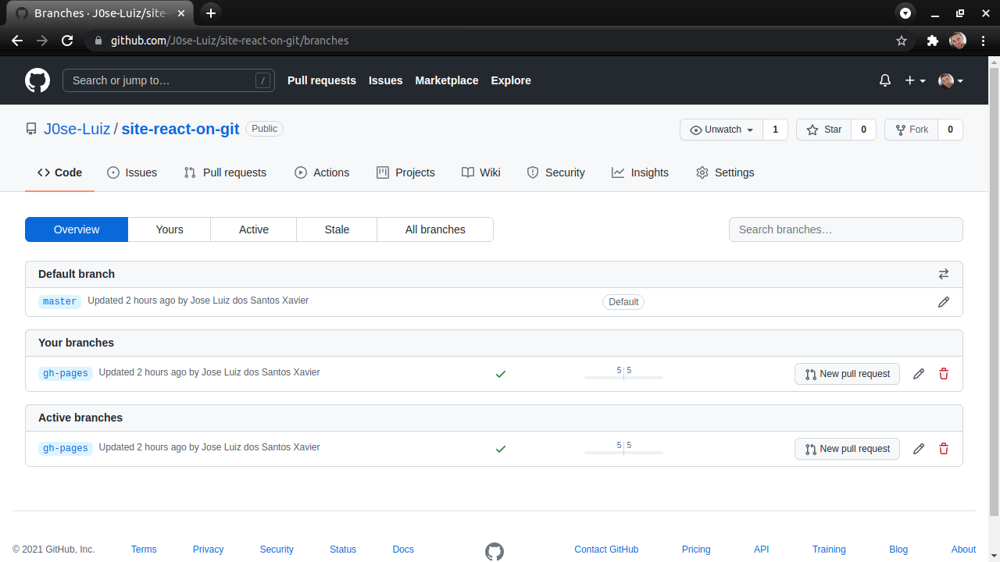

Para conferir o domínio criado para o seu site, siga o passo a passo:

* Acesse o settings do seu repositório 
* Vá até o tópico GitHub Pages
* Aqui você verá que o site está consultando a **branch gh-pages. Nessa mesma aba você visualizará** o domínio 
 [Click-me](https://j0se-luiz.github.io/site-react-on-git/)
* Agora é só clicar no link e testar o seu site

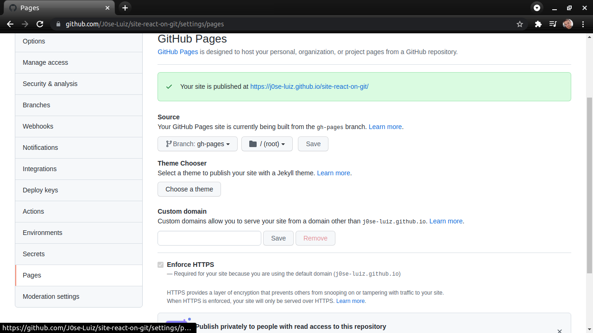


## Erros na página
Para que sua página não apresente erros, lembre-se de **sempre definir em seu projeto a URL** que a Home Page do site deve possuir.

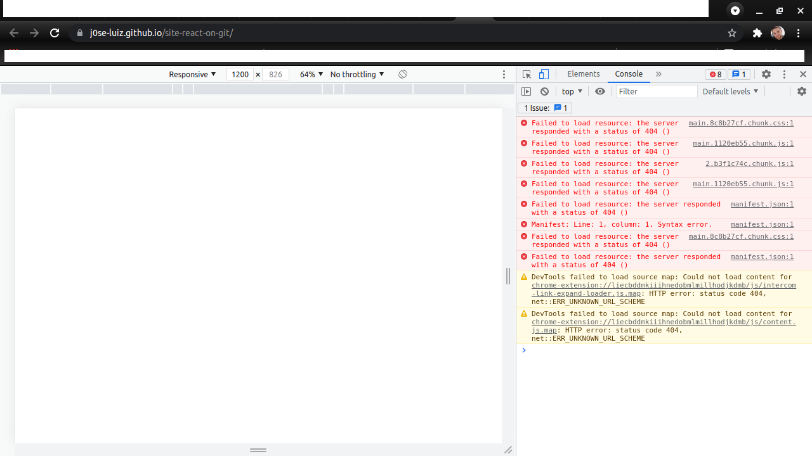

## Corrigindo Erros e automatizando deploy
* Abra o arquivo package.json
* Defina a **Home Page** do projeto react com o link do seu site gerado pelo github(arquivo package.json linha 5)

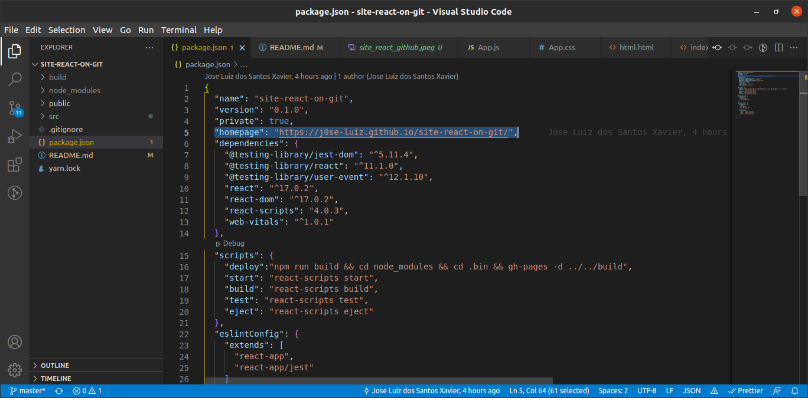 

```shell
"homepage": "[link do site]"
```

* Defina os passos usados para publicar o nosso site. Assim eles serão executados quando rodarmos o comando **npm run deploy**

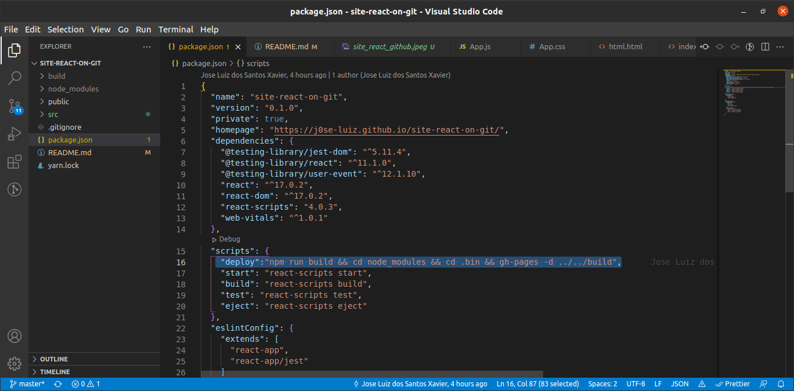

```shell
"deploy":"npm run build && cd node_modules && cd .bin && gh-pages -d ../../build"
```

Apos feito isso suba novamente o projeto com gh-pages e o seu projeto já irá funcionar.

```shell
npm run deploy
git add .
git commit -m "SUA MENSAGEM"
git push
```

Quando quiser subir uma versão nova, digite apenas o comando: **npm run deploy** e o projeto criará os arquivos necessários. não esqueça de fazer **PUSH** das suas alterações hehehe. 

## Espero que esta informação tenha sido útil =) 